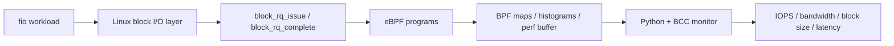

# eBPF Block I/O Observability

A Linux block-I/O monitoring toolkit built with **eBPF**, **BCC**, **Python**, and **fio**.

The project attaches eBPF programs to Linux block-layer tracepoints and collects storage performance metrics while synthetic I/O workloads are generated with `fio`. It demonstrates how kernel-level observability can be used to measure I/O behavior with low instrumentation overhead and without modifying the application being observed.

## Overview

Modern storage performance depends on more than a single throughput number. I/O workloads can differ in request rate, request size, read/write mix, and latency distribution.

This project explores those characteristics through several focused eBPF monitors:

- **IOPS** — read and write operations per second
- **Bandwidth** — read and write throughput
- **Average block size** — bytes transferred per completed operation
- **I/O latency tracing** — per-request latency events
- **Tail latency** — configurable latency percentile, such as P95

Each monitor consists of:

1. An eBPF C program that attaches to Linux block tracepoints and stores measurements in BPF maps or perf buffers.
2. A Python/BCC controller that loads the eBPF program, launches an `fio` workload, waits for or consumes measurements, and reports the resulting metric.

## Architecture



## Metrics

### IOPS

`iops.c` attaches to `block:block_rq_complete` and counts completed read and write operations separately.

`iops_monitor.py` runs an `fio` workload and divides the collected operation counts by the configured runtime:

```text
Read IOPS  = completed read operations  / runtime
Write IOPS = completed write operations / runtime
```

Files:

- `iops.c`
- `iops_monitor.py`

---

### Bandwidth

`bw.c` counts the number of bytes completed by the block layer. The program converts completed sectors to bytes using:

```text
bytes = number_of_sectors × 512
```

`bw_monitor.py` converts the accumulated byte counts into read and write bandwidth in MiB/s and also reports the read/write bandwidth ratio.

Files:

- `bw.c`
- `bw_monitor.py`

---

### Average Block Size

`avgbs.c` records both:

- total bytes transferred
- total completed operations

for reads and writes.

The Python monitor calculates:

```text
Average block size = total transferred bytes / total operations
```

Files:

- `avgbs.c`
- `avgbs_monitor.py`

---

### I/O Latency Tracing

`avglate.c` attaches to both:

- `block:block_rq_issue`
- `block:block_rq_complete`

The issue tracepoint stores a start timestamp, while the completion tracepoint calculates elapsed time in microseconds. Completed latency measurements are sent to userspace through a BPF perf buffer.

`avglate_monitor.py` consumes the perf-buffer events and prints the request type and observed latency.

Example output format:

```text
Captured I/O: PID=1234, Type=Read, Latency=415 us
```

Files:

- `avglate.c`
- `avglate_monitor.py`

> Despite the historical filename `avglate`, the current Python program streams individual latency samples rather than calculating one arithmetic average.

---

### Tail Latency

`tail.c` builds separate logarithmic latency histograms for reads and writes.

`tail_monitor.py` converts those histograms into an approximate configurable percentile. The current default is:

```python
TAIL_LATENCY_PERCENTILE = 95
```

Example output format:

```text
Tail Latency (Read 95%): ... us
Tail Latency (Write 95%): ... us
```

Files:

- `tail.c`
- `tail_monitor.py`

## Repository Structure

```text
.
├── README.md
├── avgbs.c
├── avgbs_monitor.py
├── avglate.c
├── avglate_monitor.py
├── bw.c
├── bw_monitor.py
├── iops.c
├── iops_monitor.py
├── tail.c
└── tail_monitor.py
```

## Technologies

- **eBPF** — kernel-level tracing and instrumentation
- **BCC (BPF Compiler Collection)** — loading eBPF C programs from Python
- **Python** — userspace orchestration and metric calculation
- **C** — eBPF programs
- **Linux block tracepoints** — `block_rq_issue` and `block_rq_complete`
- **fio** — synthetic storage workload generation

## Requirements

This project is intended for Linux.

You need:

- A Linux kernel with eBPF and the required block tracepoints
- BCC with Python bindings (`from bcc import BPF`)
- Python 3
- `fio`
- `psutil` for the latency-monitor script
- Root privileges or sufficient capabilities to load and attach eBPF programs
- A safe test target for the `fio` workload

Check that the relevant block tracepoints are available on your system:

```bash
sudo cat /sys/kernel/debug/tracing/events/block/block_rq_issue/format
sudo cat /sys/kernel/debug/tracing/events/block/block_rq_complete/format
```

## Safety Warning

The example scripts currently use:

```text
/dev/sdb
```

as the `fio` target and use mixed random **read/write** workloads.

**Do not run these scripts against a disk containing important data, a mounted production filesystem, or your system disk. Writing directly to a raw block device can corrupt or destroy data.**

Before running the project, change the `--filename` argument in each Python script to a disposable test device or another intentionally prepared benchmark target.

## fio Workloads

The scripts use `fio` to generate time-based direct-I/O workloads.

Typical options used in this project include:

```text
--rw=randrw
--direct=1
--numjobs=1
--time_based
--ioengine=libaio
```

Different monitors currently use slightly different runtimes, block sizes, and read/write mixes. For reproducible cross-metric experiments, these parameters should be standardized.

## Running

The Python monitor loads the matching C source file automatically, so run a monitor from the repository directory.

### IOPS

```bash
sudo python3 iops_monitor.py
```

### Bandwidth

```bash
sudo python3 bw_monitor.py
```

### Average Block Size

```bash
sudo python3 avgbs_monitor.py
```

### Latency Events

```bash
sudo python3 avglate_monitor.py
```

### Tail Latency

```bash
sudo python3 tail_monitor.py
```

## How the eBPF Side Works

The project uses several BCC data-transfer mechanisms.

### BPF Hash Maps

Counters such as operation count and transferred bytes are stored in BPF hash maps and read by Python after the workload completes.

Examples include:

```c
BPF_HASH(io_type_count, u32);
BPF_HASH(io_bytes, u32, u64);
```

### BPF Histograms

Tail latency uses BCC histograms to group latency observations into logarithmic buckets:

```c
BPF_HISTOGRAM(latency_hist_read);
BPF_HISTOGRAM(latency_hist_write);
```

### Perf Buffer

The latency tracer sends individual measurements from kernel space to userspace through:

```c
BPF_PERF_OUTPUT(events);
```

This lets the Python controller consume latency events while `fio` is running.

## What This Project Demonstrates

From a systems and observability perspective, the project demonstrates:

- Linux kernel tracing with eBPF
- BCC-based eBPF development
- Block-layer I/O tracepoints
- Kernel-to-userspace communication
- BPF hash maps and histograms
- Perf-buffer event streaming
- Storage performance metrics
- IOPS and throughput measurement
- Latency and percentile analysis
- Synthetic benchmarking with `fio`
- Python/C integration for systems tooling

## Current Implementation Notes

This repository is a prototype/learning project. Several aspects should be improved before treating the measurements as production-grade observability data:

1. **Device filtering:** the IOPS, bandwidth, average-block-size, and tail-latency probes currently observe block tracepoints without filtering for a specific device. Other system I/O may therefore be included in the counters.

2. **Bandwidth monitor map mismatch:** the current `bw_monitor.py` attempts to reference a `target_pid` BPF entry, but `bw.c` does not define a `target_pid` map. That line should be removed or a matching filter should be implemented.

3. **Latency correlation:** the latency programs use process/sector-derived keys to associate issue and completion events. Block-I/O completion can occur in a different execution context, and concurrent requests can make simple keys unreliable. A production version should correlate requests using a stable request identifier supported by the target kernel tracepoint.

4. **PID selection:** `avglate_monitor.py` scans the process table for a process named `fio`. Using the PID returned directly by `subprocess.Popen` would avoid selecting an unrelated `fio` process.

5. **Fixed runtimes:** IOPS and bandwidth calculations divide by hard-coded runtimes. Runtime should be stored once and reused both in the `fio` command and metric calculation.

6. **Result output:** `avgbs_monitor.py` prints that results were saved to a file while the file-writing code is currently commented out.

7. **Kernel compatibility:** block tracepoint field names and available context can vary across kernel versions, so probes should be validated on the target system.

These limitations are useful next steps for turning the prototype into a more robust observability tool.

## Suggested Improvements

A stronger next version could:

- Add command-line arguments for device, runtime, block size, and read/write mix.
- Filter metrics by block device.
- Use a shared Python runner instead of one controller per metric.
- Combine all measurements into one eBPF program.
- Export results as JSON or CSV.
- Add live terminal dashboards.
- Add time-series output rather than only final aggregates.
- Compare eBPF measurements against `fio`'s reported statistics.
- Add automated tests and reproducible benchmark configurations.
- Support multiple devices and workloads.
- Add CPU/memory overhead measurements for the monitoring layer.

## Resume Description

**eBPF Block I/O Observability Toolkit — C, Python, Linux**

Built an eBPF/BCC-based storage observability toolkit that instruments Linux block-layer tracepoints to measure IOPS, bandwidth, request size, and I/O latency under `fio` workloads. Used BPF maps, histograms, and perf buffers for kernel-to-userspace metric collection and implemented Python controllers for workload generation and analysis.

## Disclaimer

This project is intended for education, experimentation, and systems-performance learning. Validate the probes and benchmark target carefully before using the code on real systems.
